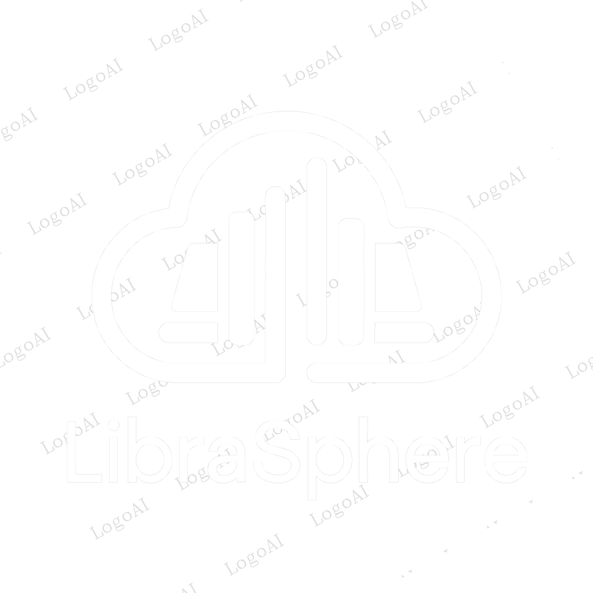
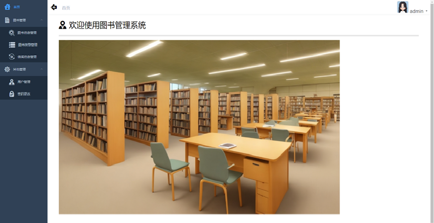

# 基于Springboot+Vue的图书管理系统Librasphere

[![Contributors][contributors-shield]][contributors-url][![Forks][forks-shield]][forks-url][![Stargazers][stars-shield]][stars-url][![Issues][issues-shield]][issues-url][![MIT License][license-shield]][license-url][![LinkedIn][linkedin-shield]][linkedin-url]

<br />
<div align="center">
  <a href="https://github.com/Revolover3-Sue/Librasphere">
    
  </a>

  <h3 align="center"> &nbsp;Libraspere    &nbsp;</h3>

  <p align="center">
    基于Springboot+Vue的图书管理系统Librasphere
    <br />
    <a href="https://github.com/Revolover3-Sue/Librasphere"><strong>浏览文档 »</strong></a>
    <br />
    <br />
    <a href="https://github.com/Revolover3-Sue/Librasphere">🔗查看 Demo</a>
    ·
    <a href="https://github.com/Revolover3-Sue/Librasphere/issues">反馈 Bug</a>
    ·
    <a href="https://github.com/Revolover3-Sue/Librasphere/issues">请求新功能</a>
  </p>
</div>

## 项目简介

Librasphere是一套在线图书管理系统，技术选型为前后端分离，前端基于Vue.js，后端基于Java语言开发，使用了SpringBoot和MyBatis框架提高开发效率和质量。主要面向图书馆管理员和读者在图书管理、图书借阅等需求。  


## 技术栈

### 后端技术
- **核心框架：** Spring Boot 2.x
- **安全框架：** Spring Security + JWT
- **数据库：** MySQL 8.0
- **数据库连接池：** HikariCP
- **API文档：** Swagger/SpringDoc
- **日志框架：** SLF4J + Logback
- **工具库：** 
  - Lombok - 简化代码
  - MapStruct - 对象映射
  - Hutool - 工具集
- **构建工具：** Maven
- **版本控制：** Git

### 前端技术
- Vue.js 2.x
- Element UI
- Axios
- Vue Router
- Vuex

## 项目结构
图书管理系统向下划分为图书管理、图书类型管理、用户信息管理和借阅管理四个模块。图书管理主要负责对图书的信息进行管理，以及管理员进行图书的查询；图书类型管理主要关联图书信息进行分类，可以对类型进行管理，以及对类型进行条件查询；借阅管理主要负责读者进行借书、还书操作，以及查询读者历史借阅信息；用户信息管理可以针对图书管理员和读者的信息进行管理。  


项目的数据结构由软件结构决定。  


## 核心功能

### 1. 用户管理
- 用户注册与登录
- 角色权限管理（管理员、普通用户）
- 用户信息管理
- JWT 令牌认证

### 2. 图书管理
- 图书信息的 CRUD 操作
- 图书分类管理
- 图书搜索（支持多条件）
- 图书库存管理

### 3. 借阅管理
- 图书借阅
- 图书归还
- 借阅历史查询
- 借阅状态追踪
- 超期提醒

## 环境要求
- JDK 1.8+
- Maven 3.6+
- MySQL 8.0+
- Redis (可选，用于缓存)

## 项目搭建
### 后端搭建
  1.打开终端并导航项目目录
  2.运行以下命令构建项目
  * Power Shell
  ```sh
  ./mvnw clean package 
  ```
  这会在target目录下生成一个jar文件
  或者可以使用gradle
  * Power Shell
  ```sh
  ./gradlew build 
  ```
  这会在bulid/lib目录下生成一个jar文件
  3.打开终端并导航到包含 JAR 文件的目录。
  4.运行以下命令启动应用：
  * Power Shell
  ```sh
  java -jar your-project-name-0.0.1-SNAPSHOT.jar
  ```
其中，your-project-name-0.0.1-SNAPSHOT.jar 是你构建出来的 JAR 文件名称。
### 前端搭建
  1.启动node.js
  2.运行
  * Node.js
  ```sh
  npm run dev
  ```


## 版本历史

- v1.0.0 
  - 基础功能实现
  - 用户认证授权
  - 图书管理基础功能
  
- v1.1.0 (进行中)
  - [x] 添加缓存支持
  - [x] 优化日志
  - [ ] 添加对借阅图书书目的限制
  - [ ] 优化查询性能
  - [ ] 添加批量操作功能

## 贡献

贡献让开源社区成为了一个非常适合学习、启发和创新的地方。你所做出的任何贡献都是**受人尊敬**的。

如果你有好的建议，请复刻（fork）本仓库并且创建一个拉取请求（pull request）。你也可以简单地创建一个议题（issue），并且添加标签「enhancement」。不要忘记给项目点一个 star！再次感谢！

1. 复刻（Fork）本项目
2. 创建你的 Feature 分支 (`git checkout -b feature/AmazingFeature`)
3. 提交你的变更 (`git commit -m 'Add some AmazingFeature'`)
4. 推送到该分支 (`git push origin feature/AmazingFeature`)
5. 创建一个拉取请求（Pull Request）

## 许可证

根据 MIT 许可证分发。打开 [LICENSE.txt](LICENSE.txt) 查看更多内容。


[contributors-shield]: https://img.shields.io/github/contributors/Revolove3-Sue/Librasphere.svg?style=for-the-badge
[contributors-url]: https://github.com/admin1025/Libraspher/graphs/contributors
[forks-shield]: https://img.shields.io/github/forks/Revolove3-Sue/Librasphere.svg?style=for-the-badge
[forks-url]: https://github.com/Revolove3-Sue/Librasphere/network/members
[stars-shield]: https://img.shields.io/github/stars/aRevolove3-Sue/Librasphere.svg?style=for-the-badge
[stars-url]: https://github.com/Revolove3-Sue/Librasphere/stargazers
[issues-shield]: https://img.shields.io/github/issues/Revolove3-Sue/Librasphere.svg?style=for-the-badge
[issues-url]: https://github.com/Revolove3-Sue/Librasphere/issues
[license-shield]: https://img.shields.io/github/license/Revolove3-Sue/Librasphere.svg?style=for-the-badge
[license-url]: https://github.com/Revolove3-Sue/Librasphere/blob/master/LICENSE.txt
[linkedin-shield]: https://img.shields.io/badge/-LinkedIn-black.svg?style=for-the-badge&logo=linkedin&colorB=555
[linkedin-url]: https://linkedin.com/in/othneildrew
[product-screenshot]: images/screenshot.png